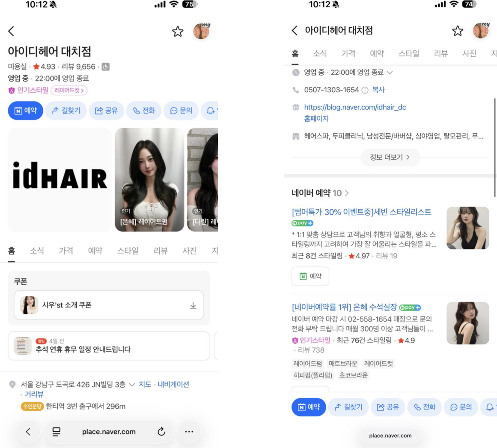
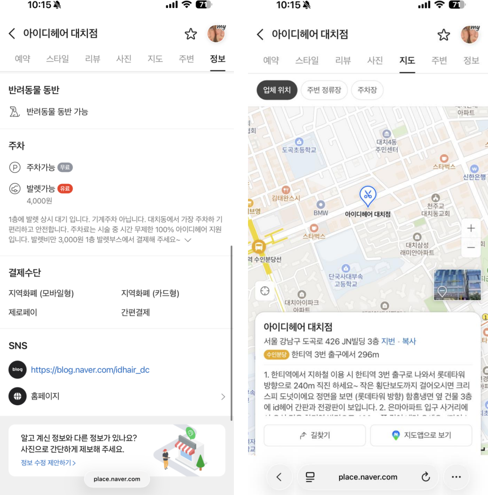
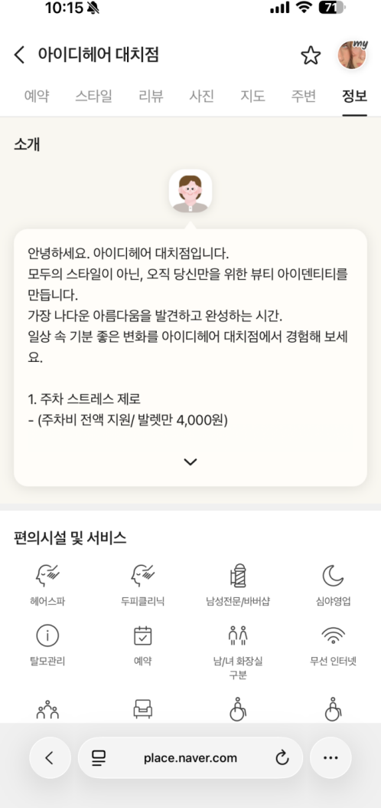
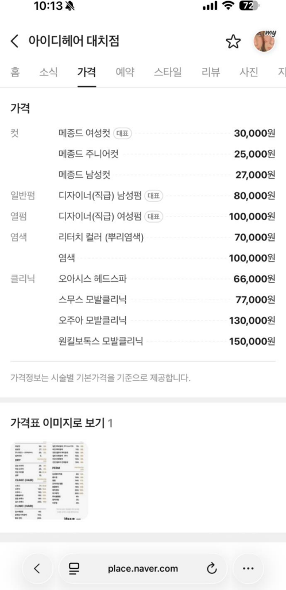
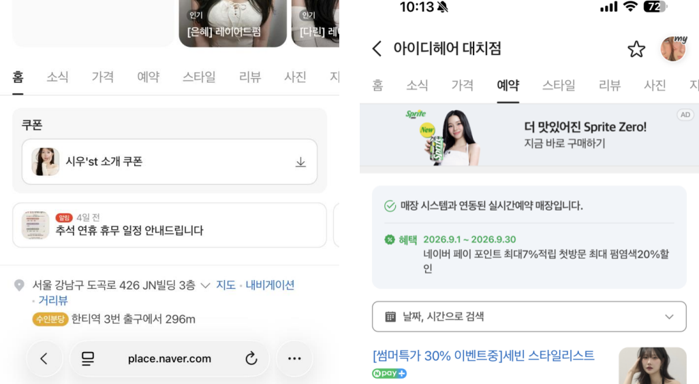
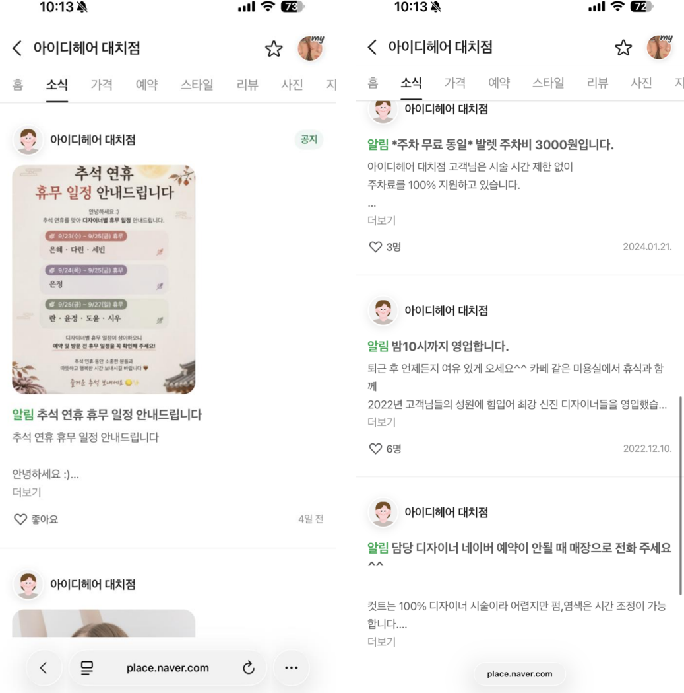
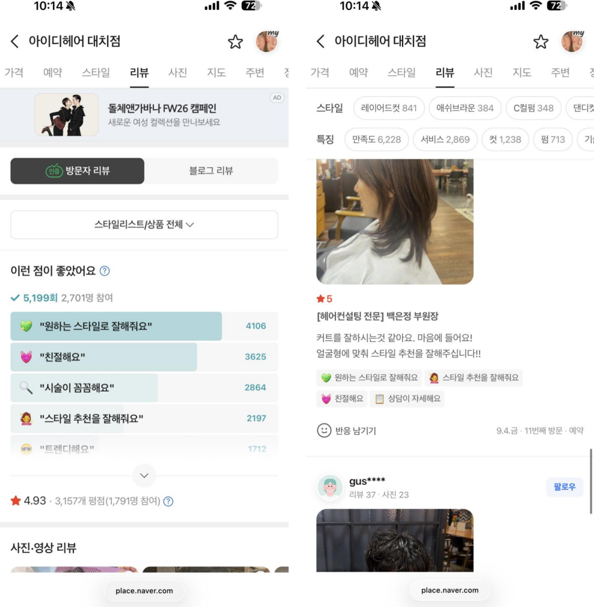
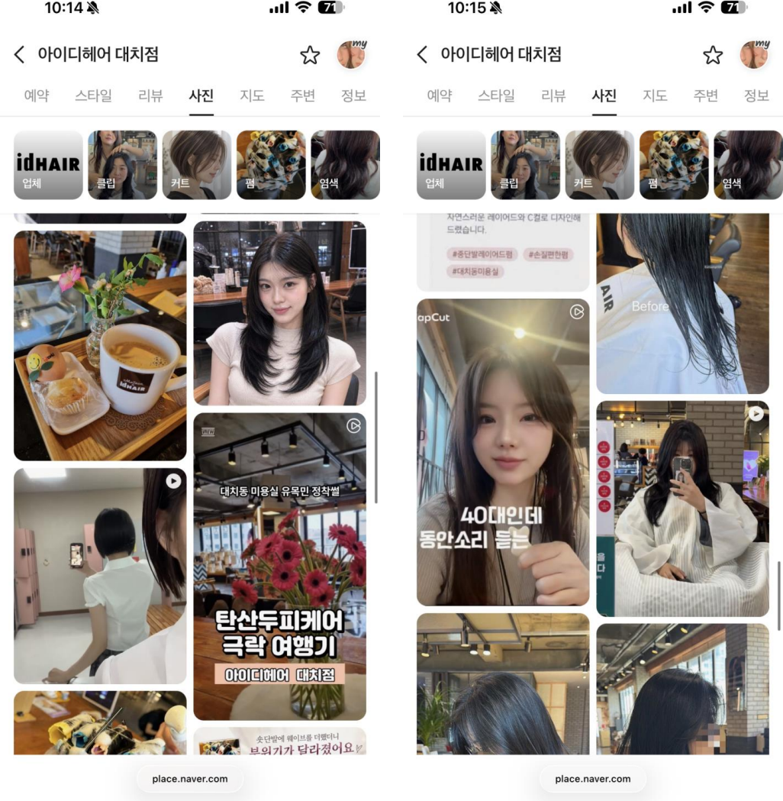

# 아이디헤어 대치점 네이버 플레이스 진단 리포트

| 항목 | 내용 |
| --- | --- |
| 진단 기준일 | 2026년 9월 10일 플레이스 화면 기준 (캡처 19쪽) |
| 비교 기준 | **프랜차이즈형 고객수 비즈니스 타입**의 플레이스 셋팅 기준값 (기준 하한과 상위값, 2026년 8월 실측) |
| 가격대 보정 | 아이디헤어 대치점은 객단가 8~9만원대이므로, 가격 관련 기준(대표가격 구간·첫방문 할인 강도)은 **상위 가격대용으로 다시 계산한 값**을 씁니다 |
| 점검 결과 | 셋팅 체크 32항목 중 **11개 충족**. 가격·쿠폰·소식 3개 영역이 시급, 5개 영역이 보완, 1개 영역이 양호 |
| 한 줄 결론 | **디자이너의 실력과 지명도는 이미 상위권인데, 플레이스가 그것을 보여주지 못하고 있어요.** 가격을 내릴 일이 아니라, 이미 있는 혜택과 전문성이 화면에 보이게 만드는 일이 필요해요 |

## 1. 한눈에 보기

아이디헤어 대치점의 플레이스에는 잘 만들어진 것이 많아요. 디자이너 9명이 모두 전문 분야 라벨을 달고 있고, 개인 리뷰가 1,225건·738건·702건까지 쌓인 지명 구조가 있고, 31번째·25번째 방문 리뷰가 보일 만큼 단골이 탄탄해요. 리뷰 키워드 1위도 '원하는 스타일로 잘해줘요'로, 프랜차이즈형 고객수 타입의 최상위 매장과 같은 구조예요.

그런데 그 힘이 플레이스 화면에서는 보이지 않아요. 가격 탭에는 할인 라벨이 하나도 없어서 여성펌·염색이 정가 10만원으로 읽히고, 쿠폰은 디자이너 한 명 이름의 쿠폰 1개뿐이고, 소식 탭 맨 위는 추석 휴무 공지이고, 리뷰에는 답글이 없고, 스타일정보는 110장이에요. 프랜차이즈형 고객수 타입과 비교하면 **'매장의 실력'은 기준 이상, '플레이스 셋팅'은 기준 이하**인 상태예요.

**지금 바로 바꾸면 효과가 큰 다섯 가지예요.**

1. **가격 탭에 할인 라벨을 붙여 주세요.** 예약 탭에는 이미 '첫방문 펌·염색 20%'가 있어요. 이 20%를 가격 이름에 '(첫방문20%)'로 붙이면 여성펌·염색이 10만원이 아니라 8만원으로 보이고, 이 8만원이 상위 가격대의 대표가격 구간(8만~9만9천원)에 정확히 들어가요. 가격은 그대로 두고 라벨만 붙이는 일이에요.
2. **리뷰에 답글을 달아 주세요.** 캡처한 리뷰 14건 모두 답글이 없어요. 상위 가격대에서 답글은 '전문성의 증거'예요. 담당 디자이너 이름으로, 시술 내용을 되짚는 답글을 24시간 안에 다는 것부터 시작해요.
3. **첫방문 20% 혜택을 매장 공통 쿠폰으로 만들어 주세요.** 지금은 쿠폰 탭이 사실상 비어 있어요. 첫방문·길찾기·포토리뷰·이달의 케어, 이렇게 4가지 쿠폰이 기준이에요.
4. **소식 탭 맨 위에 이달의 혜택 소식을 올려 주세요.** 지금은 휴무 공지와 2022년·2024년 공지가 보여요. 매월 1일 기간을 적은 이벤트 소식 하나면 돼요.
5. **직급별 가격표 이미지를 올려 주세요.** 상위 가격대의 가격은 직급이 설명해요. 지금은 가격표 이미지가 1장이고 '디자이너(직급)' 한 줄뿐이에요. 디자이너·수석실장·부원장·원장 가격을 표로 만든 이미지 10장이 기준이에요.

## 2. 무엇과 비교했나요

이 리포트는 **프랜차이즈형 고객수 비즈니스 타입**(신규 고객 수를 늘리는 데 집중하는 프랜차이즈 지점 유형)의 최상위 매장들이 실제로 셋팅해 둔 값을 기준으로 삼아요. 기준값에는 하한(이 정도는 되어야 한다)과 상위값(최상위는 이 정도다)이 있어요.

| 지표 | 프랜차이즈형 고객수 타입 기준 하한 | 기준 상위값 | 아이디헤어 대치점 | 읽는 법 |
| --- | --- | --- | --- | --- |
| 평점 | 4.92 | 4.96 | **4.93** | 기준 안. 품질은 동급이에요 |
| 방문자 리뷰 | 14,132 | 30,170 | **7,758** | 하한의 55%. 시간이 걸리는 항목이라 3개월 차 과제예요 |
| 블로그 리뷰 | 1,172 | 1,689 | **약 1,898** (헤더 9,656에서 역산) | 상위값 이상으로 추정돼요 |
| 스타일정보 | 300장 | 300장 | **110장** | 37%. 두 달 안에 채울 수 있는 항목이에요 |
| 가격표 이미지 | 10장 | 1장 | **1장** | 직급별 가격표를 넣으면 바로 해결돼요 |
| 예약 상품 구조 | 디자이너별 + 안내형 1 + 이벤트형 1 | 11개 | 디자이너 9 + 안내형 1 + 이벤트형 0 (+제휴 1) | 이벤트형 상품 하나가 비어 있어요 |
| 쿠폰 구조 | 유입·방문·리뷰·재방문 4종 | 5종 | 1종 (디자이너 한 명 이름) | 3~4종이 비어 있어요 |

**상위 가격대 보정.** 프랜차이즈형 고객수 타입의 원래 기준은 객단가 6~7만원 매장을 위한 것이에요. 아이디헤어 대치점은 객단가 8~9만원대라서 가격 관련 기준은 아래처럼 다시 계산해서 적용했어요. 이 표의 숫자는 원래 기준의 계산식에 새 목표 객단가를 넣어 도출한 값이지, 상위 가격대 매장을 실측한 값은 아니에요.

| 항목 | 객단가 6~7만원 기준 (원래) | 객단가 8~9만원 기준 (보정) | 이유 |
| --- | --- | --- | --- |
| 대표가격(앵커) 구간 | 60,000~79,000원 | **80,000~99,000원** | 목표 객단가를 바꿔 계산 |
| 첫방문 할인 강도 | 30% 조건형 ~ 50% 전품목 | **20~30% 조건형** (예약+네이버페이 결제) | 50%를 쓰면 정가가 16~20만원으로 보여 상위 가격대의 신뢰가 깨져요 |
| 미끼 상품(컷) | 15,000~24,000원 | 30,000~45,000원 (직급별) | 지금 컷 30,000원이 여기 해당해요 |
| 주력(펌·염색) | 50,000~70,000원 | **80,000~99,000원** | 대표가격 구간과 같아요 |
| 업셀(케어·패키지) | 90,000~150,000원 | 120,000~200,000원 | 지금 클리닉 130,000·150,000원이 여기 해당해요 |
| 포토리뷰 쿠폰 | 3,000원 할인 | 홈케어 증정 또는 5,000~10,000원 | 객단가 대비 3,000원은 약해요 (금액은 마진 확인 후 결정) |

## 3. 항목별 진단

각 항목마다 실제 화면, 지금 상태, 프랜차이즈형 고객수 타입 기준과의 차이, 보완이 필요한 점 순서로 적었어요.

### ① 기본 정보 (홈 상단·정보 요약)

- **지금 상태**: 업체명 '아이디헤어 대치점', 카테고리 미용실, 22:00 영업 종료(심야영업), 0507 스마트콜, 블로그와 홈페이지 링크, 편의시설 8가지가 등록돼 있어요. 상단 대표사진은 로고 이미지와 인기 스타일 사진이에요.
- **기준과 비교하면**: 프랜차이즈형 고객수 타입 기준은 SNS 링크를 블로그·인스타그램·예약까지 모두 연결하는 것이에요. 지금은 인스타그램과 네이버 예약 링크가 빠져 있어요. 나머지 기본 정보는 기준을 충족해요.
- **보완이 필요해요**: 정보 탭 SNS에 인스타그램과 네이버 예약 링크 추가가 필요해요.
- **판정**: 보완 (기본 정보 자체는 좋고, 링크 2개만 빠져 있어요)

### ② 주차 안내와 찾아오는 길

- **지금 상태**: 찾아오는 길은 '한티역 3번 출구 → 롯데타워 방향 240m → 크리스피 도넛 → 함흥냉면 옆 건물 3층'처럼 아주 구체적이에요. 주차도 '1층 발렛 상시 대기, 주차료 100% 지원'으로 친절해요. 그런데 발렛 요금이 정보 탭 요금표와 소개문에는 4,000원, 주차 안내문과 2024년 소식에는 3,000원으로 적혀 있어요.
- **기준과 비교하면**: 찾아오는 길 서술은 프랜차이즈형 고객수 타입의 기준(출구·거리·경유지)을 넘어서요. 다만 기준은 주차 정보가 모든 화면에서 같은 값이어야 한다는 것이고, 지금은 화면마다 금액이 달라요.
- **보완이 필요해요**: 발렛 요금을 한 가지로 통일하고, 옛날 금액이 적힌 2024년 소식은 내리거나 수정이 필요해요. 첫방문 고객이 차를 가지고 오는 대치동 상권에서는 이 한 줄이 신뢰를 좌우해요.
- **판정**: 보완

### ③ 소개문 (정보 탭)

- **지금 상태**: '모두의 스타일이 아닌, 오직 당신만을 위한 뷰티 아이덴티티'라는 브랜드 문장으로 시작하고, 이어서 '1. 주차 스트레스 제로'로 넘어가요. 보이는 범위에 '대치동 미용실', '한티역 미용실' 같은 지역 검색어가 없고, 시술 이름 나열과 외국어 표기도 없어요.
- **기준과 비교하면**: 프랜차이즈형 고객수 타입 기준은 소개문에 '[지역]미용실' 결합 검색어를 3번 이상 넣고, 여성·남성 시술명을 구체적으로 적고, 영어·일어·중국어 시술 키워드를 함께 적는 것이에요. 소개문은 고객보다 검색엔진이 먼저 읽는 글이라서 그래요. 아이디헤어의 도윤 수석실장 블로그 제목('강남 한티역미용실 50대 단발펌')은 이미 이 공식을 쓰고 있는데, 소개문만 빠져 있어요.
- **보완이 필요해요**: 브랜드 문장은 살리되, '대치동미용실 아이디헤어 대치점', '한티역미용실'을 3번 이상 자연스럽게 넣는 것이 필요해요. 레이어드컷·C컬펌·그레이스펌·모류교정 뿌리볼륨펌·태슬컷, 가르마펌·맨즈펌·다운펌 같은 시술 이름을 적고, 상위 가격대답게 직급과 전문 분야를 소개하는 문단을 하나 더하면 좋아요. 마지막에 cut, perm, color, clinic / カット / 剪发 병기가 필요해요.
- **판정**: 보완

### ④ 가격 (가격 탭)

- **지금 상태**: 컷 25,000~30,000원, 남성펌 80,000원, 여성펌 100,000원, 염색 70,000~100,000원, 클리닉 66,000~150,000원. 대표 배지는 여성컷 30,000원·남성펌 80,000원·여성펌 100,000원 세 개예요. 11개 상품 어디에도 '(첫방문20%)' 같은 할인 라벨이 없고, 기장 추가요금 안내가 없고, 직급은 '디자이너(직급)' 한 줄뿐이고, 가격표 이미지는 1장이에요.
- **기준과 비교하면**: 프랜차이즈형 고객수 타입의 최상위 매장은 대표 상품 전부에 할인 라벨을 붙여서 '정가'가 아니라 '첫방문 실제 결제가'가 대표가격으로 보이게 해요. 상위 가격대로 보정한 대표가격 구간은 80,000~99,000원이에요. 남성펌 80,000원은 이 구간 안에 있지만, 여성펌·염색은 100,000원 정가로 노출돼서 구간 밖으로 보여요. 그런데 예약 탭에는 이미 '첫방문 최대 펌·염색 20%' 혜택이 있어요. 20%를 적용하면 여성펌·염색이 80,000원이 되어 구간 안에 정확히 들어와요.
- **보완이 필요해요**: 가격을 바꾸지 않고 라벨만 붙이는 것이 필요해요. 아래 표대로 하면 돼요. 기장 추가요금(어깨아래·가슴아래) 금액 명시도 필요해요. 10만원대 시술에서 현장 추가금은 분쟁과 나쁜 리뷰의 원인이 되기 쉬워요. 그리고 직급별 가격표 이미지 10장이 필요해요. 상위 가격대의 가격은 직급이 설명해 주는데, 지금은 수석실장·부원장·원장 가격이 어디에도 없어요.

| 구분 | 지금 | 이렇게 바꿔요 | 설명 |
| --- | --- | --- | --- |
| 여성펌 (대표) | 디자이너(직급) 여성펌 100,000 | 디자이너 여성펌 (첫방문20%) 80,000 | 정가 100,000원 기준. 예약 탭 혜택과 같은 숫자 |
| 염색 | 염색 100,000 | 염색 (첫방문20%) 80,000 | 정가 100,000원 기준 |
| 남성펌 (대표) | 디자이너(직급) 남성펌 80,000 | 남성펌 (네이버예약) 80,000 | 이미 구간 안. 라벨만 |
| 리터치 컬러 | 70,000 | 리터치 컬러 (네이버예약) 70,000 | |
| 컷 (대표) | 메종드 여성컷 30,000 | 여성컷 (네이버예약) 30,000 + 수석·부원장·원장 컷 별도 행 | 직급별 가격 노출 |
| 클리닉 | 오주아 130,000 / 원킬보톡스 150,000 | 비고에 '펌·염색과 함께 하면 이달의 케어 할인' | 재방문 쿠폰과 연결 |
| 추가요금 | 없음 | 어깨아래 +○○,○○○ / 가슴아래 +○○,○○○ 명시 | 금액은 매장에서 정해요 |

- **판정**: 시급 (가격 영역이 이 매장에서 가장 먼저 손볼 곳이에요)

### ⑤ 쿠폰과 혜택

- **지금 상태**: 쿠폰은 "시우'st 소개 쿠폰" 1개예요. 특정 디자이너 이름이 붙어 있고, 혜택 내용은 열어 보기 전에는 알 수 없어요. 매장 공통 혜택인 '네이버페이 포인트 최대 7% 적립 + 첫방문 최대 펌·염색 20% 할인'은 예약 탭 안내문에만 있고 쿠폰으로는 없어요.
- **기준과 비교하면**: 프랜차이즈형 고객수 타입 기준은 고객이 오는 단계마다 쿠폰을 하나씩 두는 것이에요. 유입(첫방문 할인) → 방문 확정(길찾기 이벤트) → 리뷰(포토리뷰 쿠폰) → 재방문(이달의 케어 쿠폰), 이렇게 4종이에요. 지금은 4종 모두 비어 있거나 절반만 있어요. 쿠폰 탭이 차 있으면 홈 화면에 '쿠폰이 있어요'라는 훅이 자동으로 생겨요.
- **보완이 필요해요**: 다음 4가지 쿠폰 발행이 필요해요. 상위 가격대라서 50% 같은 큰 할인은 쓰지 않고, 이미 있는 20%를 조건형(네이버 예약 + 네이버페이 결제)으로 쿠폰화하면 돼요.

| 단계 | 쿠폰 이름 (예시) | 내용 | 설명 |
| --- | --- | --- | --- |
| 유입 | 첫방문 펌·염색 20% 쿠폰 (전 디자이너) | 네이버 예약 + 네이버페이 결제 시 | 시우 쿠폰은 여기에 흡수해요 |
| 방문 확정 | 길찾기 방문 이벤트 | 네이버 길찾기 화면을 보여 주면 홈케어 샘플 증정 | 발렛 안내와 같이 노출하면 차량 고객에게 효과가 커요 |
| 리뷰 | 포토리뷰 쿠폰 | 사진 리뷰 작성 시 헤드스파 업그레이드 또는 5,000~10,000원 | 금액은 마진 확인 후 정해요 |
| 재방문 | 이달의 프리미엄 케어 쿠폰 | 오주아·원킬보톡스 클리닉을 펌·염색과 함께 하면 할인, 매월 교체 | 재방문 이유이자 객단가를 올리는 장치예요 |

- **판정**: 시급

### ⑥ 소식 (소식 탭)

- **지금 상태**: 소식 6건이 모두 '알림' 유형이에요. 맨 위가 추석 연휴 휴무 공지, 그다음 8월 마이리얼트립 라이브 특가, 발렛비 공지 2건(2026년과 2024년), 2022년 '밤 10시까지 영업' 공지예요. 기간이 적힌 이달의 혜택 소식은 없어요. 예약 상품에 붙은 '썸머특가' 라벨이 9월에도 그대로예요.
- **기준과 비교하면**: 프랜차이즈형 고객수 타입의 최상위 매장은 소식 탭을 '이 매장이 지금 살아 있다'는 증거로 써요. 매월 1일 기간이 적힌 이벤트 소식을 올리고, 이달의 추천 디자이너 소식을 올리고, 반응이 좋으면 '한 달 더 연장' 소식으로 다시 올려요. 신규 고객이 처음 보는 소식이 휴무 공지나 요금 공지이면, 소식 탭이 고객을 밀어내는 방향으로 작동해요.
- **보완이 필요해요**: 매월 1일에 기간을 적은 이벤트 소식 등록이 필요해요. 예를 들어 '[9월 EVENT] 환절기 손상모 리셋, 첫방문 펌·염색 20% + 이달의 케어 (9.1~9.30)'처럼요. 휴무 공지는 그 아래로 내려가면 돼요. 2022년·2024년 공지는 정리하고, '썸머특가' 라벨은 이달 이름으로 바꿔 주세요. 이달의 추천 디자이너 소식은 신입인 세빈 스타일리스트부터 시작하면 좋아요.
- **판정**: 시급

### ⑦ 예약 상품 (예약 탭)

![예약 탭. 디자이너 9명 전원이 [헤어컨설팅 전문] 같은 전문성 라벨을 달고 있어요. 다만 첫 줄이 '예약 마감 시 전화 문의', '휴가 안내'로 시작하는 상품이 있어요](산출물/이미지/아이디헤어-대치점/07-예약상품.png)

- **지금 상태**: 디자이너 9명이 각각 예약 상품으로 등록돼 있고, 전원 네이버페이 배지가 있고, 8명이 인기스타일 배지를 갖고 있어요. 상품 이름에 [헤어컨설팅 전문] [네이버예약률 1위] [No.1 맨즈 전문] 같은 전문성 라벨이 붙어 있고, 소개문에 '23년차 경력', '재방문률 99%, 누적 2,500명', '지명 200명 이상' 같은 사실이 적혀 있어요. 지명 없는 고객용 '맞춤형 스타일리스트' 상품과 마이리얼트립 제휴 상품도 있어요. 다만 소개문 첫 줄이 '예약 마감 시 02-558-1654로 전화'(은혜·란), '9월 21~28일 휴가'(미애), '월 off, 목 야간'(시우)처럼 운영 안내로 시작하는 상품이 많아요. 첫방문 혜택을 첫 줄에 쓴 상품은 세빈 한 명이에요.
- **기준과 비교하면**: 구조(디자이너별 상품 + 안내형 상품)는 프랜차이즈형 고객수 타입 기준을 넘어서요. 전문성 라벨은 상위 가격대 매장의 표준으로 삼아도 될 만큼 좋아요. 기준에서 빠진 것은 두 가지예요. 하나는 소개문 첫 두 줄이에요. 목록에서 미리보기로 보이는 자리라서 기준은 '전문성 → 첫방문 혜택 → 고객에게 하는 약속' 순서로 채우는 것인데, 지금은 그 자리를 운영 공지가 차지하고 있어요. 다른 하나는 이달의 이벤트와 연결된 독립 이벤트 상품이 없다는 점이에요.
- **보완이 필요해요**: 9개 상품의 첫 두 줄을 같은 순서로 맞추는 것이 필요해요. '[전문성 라벨] → ((첫방문 20% 혜택)) → 고객 관점의 한 문장 약속' 순서예요. 예약 마감·휴가·휴무 안내는 세 번째 줄 이후로 내려요. 그리고 이달의 이벤트와 연결된 이벤트형 상품 1개를 따로 만들어 주세요. 신입 세빈 스타일리스트(리뷰 19건)와 맞춤형 상품(최근 예약 1건)은 초기 리뷰 10건을 모으는 캠페인이 필요해요.
- **판정**: 보완 (구조는 좋고, 첫 줄 순서만 고치면 돼요)

### ⑧ 스타일정보 (스타일 탭)

![스타일 탭. 110장이 등록돼 있고, 제목이 '[다린] 그레이스펌'처럼 디자이너 이름과 시술명으로 되어 있어요. 같은 사진이 3장 연속 올라간 곳도 있어요](산출물/이미지/아이디헤어-대치점/08-스타일정보.png)

- **지금 상태**: 스타일정보 110장(최대 300장). 제목은 '[은혜] 레이어드펌', '[다린] 그레이스펌', '[윤정] 단발레이어드컷'처럼 디자이너 이름 + 시술명 형식이에요. 태그(레이어드컷·C컬펌·애쉬브라운 등)는 잘 달려 있어요. 같은 모델 사진이 '[세빈] 중단발 레이어드펌' 제목으로 3장 연속 올라가 있고, 사진 배경은 회색 벽·벽돌·야간 실내 등으로 섞여 있어요.
- **기준과 비교하면**: 프랜차이즈형 고객수 타입 기준은 300장을 채우고, 제목을 '고객의 고민 + 해결 스타일' 형식으로 쓰는 것이에요. 고객은 '레이어드컷'을 검색하기 전에 '얼굴 커 보이는 단발', '손질 힘든 머리'라는 고민을 갖고 있어서, 고민으로 시작하는 제목이 '스타일' 검색에 더 잘 걸려요. 지금은 장수가 37%이고 제목이 시술명 중심이에요. 재미있는 점은 이 매장의 클립 표지('대치동 미용실 유목민 정착썰', '40대인데 동안소리 듣는')는 이미 고민 카피 형식이라는 거예요.
- **보완이 필요해요**: 디자이너 9명이 주 3장씩 올리면 7주 안에 300장이 돼요. 제목은 클립 카피처럼 바꾸면 돼요. 예를 들어 '40대인데 동안소리 듣는 레이어드펌', '대치동 미용실 유목민이 정착한 C컬펌', '아침 손질 5분 줄이는 슬릭펌'처럼요. 중복 사진 정리와 배경 톤 통일(밝은 단색 벽)도 필요해요.
- **판정**: 보완

### ⑨ 리뷰와 답글 (리뷰 탭)

- **지금 상태**: 방문자 리뷰 7,758건, 평점 4.93. 키워드 1위 '원하는 스타일로 잘해줘요' 4,106건, 2위 '친절해요' 3,625건. 개별 리뷰에는 '고급스러워요', '상담이 자세해요', '맞춤 케어를 잘해줘요', '손상이 적어요'가 반복해서 나와요. 31번째 방문, 25번째 방문 리뷰도 보여요. 사진 리뷰가 많고 '리뷰 클렌징 시스템 작동중' 배너도 있어요. 그런데 캡처한 리뷰 14건 전부에 사장님이나 디자이너의 답글이 없어요.
- **기준과 비교하면**: 리뷰의 '질'은 프랜차이즈형 고객수 타입의 최상위 매장과 같은 구조예요(키워드 1위가 같아요). 기준에서 빠진 것은 답글이에요. 기준은 담당 디자이너가 실명으로 모든 리뷰에 24시간 안에 답글을 다는 것이고, 답글은 '인사와 자기소개 → 이번 시술을 어떤 의도로 했는지 → 집에서 손질하는 팁 → 함께한 스태프 언급 → 다음 방문 제안' 다섯 단계로 써요. 상위 가격대에서는 이 답글이 '왜 이 가격인지'를 설명하는 자리예요. 고객이 '상담이 자세해요'라고 써 주면, 답글에서 그 상담 내용을 되짚어 줘야 검색으로 들어온 다음 고객에게도 전달돼요.
- **보완이 필요해요**: 새 리뷰 답글률 100%가 필요해요. 리뷰가 많이 달리는 백은정 부원장·윤정 수석실장·시우 실장부터 시작하고, 최근 30일 리뷰는 소급해서 다는 것이 좋아요. 다섯 단계 답글의 표준 문안을 하나 만들어 두면 9명이 같은 품질로 쓸 수 있어요. 포토리뷰 쿠폰(⑤)이 생기면 리뷰 수집 장치도 함께 완성돼요.
- **판정**: 보완이지만, 상위 가격대에서는 1개월 차에 반드시 해야 하는 일이에요

### ⑩ 사진과 클립 (사진 탭)

- **지금 상태**: 사진 탭에 업체·클립·커트·펌·염색 카테고리가 모두 있어요. 매장 내부, 브랜드 머그, 꽃꽂이 클래스, 생일 파티 같은 매장 분위기 사진과 시술 사진이 섞여 있고, 클립이 여러 개 있어요. 클립 표지 문구가 '대치동 미용실 유목민 정착썰', '40대인데 동안소리 듣는', '시크한데, 러블리한 태슬컷'처럼 고객의 말로 되어 있어요.
- **기준과 비교하면**: 프랜차이즈형 고객수 타입 기준(전 카테고리 채우기 + 클립 등록 + 표지에 고민 카피)을 충족해요. 이 매장에서 가장 잘 되어 있는 곳 중 하나예요.
- **보완이 필요해요**: 이 클립 카피를 스타일정보 제목(⑧)으로 가져오는 것 외에는 없어요. 클립 표지에 '대치동 미용실'이라는 지역 검색어를 계속 넣어 주세요.
- **판정**: 양호, 유지

### ⑪ 재방문 장치

- **지금 상태**: 재방문은 디자이너 개인의 지명력으로 일어나고 있어요(재방문 배지 2명, 고차수 방문 리뷰 다수). 매장 차원의 장치, 즉 이달의 케어 쿠폰, 패키지, 재방문 유도 상품은 없어요.
- **기준과 비교하면**: 프랜차이즈형 고객수 타입의 최상위 매장은 매월 바뀌는 케어 쿠폰으로 '이번 달에만'이라는 재방문 이유를 만들어요.
- **보완이 필요해요**: ⑤의 이달의 프리미엄 케어 쿠폰과 ⑨의 답글 다섯 번째 단계(다음 방문 제안)가 그 장치예요. 3개월 차에 펌·염색과 케어를 묶은 세트 상품 2단계(예: 펌+오주아 클리닉, 염색+원킬보톡스)를 만들면 재방문과 객단가를 같이 잡을 수 있어요.
- **판정**: 보완

## 4. 잘하고 있는 것 — 그대로 유지해요

- **디자이너 전문성 라벨**: [헤어컨설팅 전문] 23년차, [레이어드 전문] 재방문률 99%·누적 2,500명, [No.1 맨즈 전문] 지명 200명, [단발 태슬컷전문]. 상위 가격대 매장의 표준 문형으로 삼아도 좋아요.
- **개인 지명 구조**: 리뷰 1,225건(란 부원장)·738건(은혜 수석실장)·702건(미애 원장), 31번째·25번째 방문 리뷰, 재방문 배지.
- **리뷰의 질**: 키워드 1위 구조가 최상위 매장과 같고, '고급스러워요'·'상담이 자세해요'·'손상이 적어요'가 반복돼요.
- **찾아오는 길과 주차 안내의 구체성**: 대치동 차량 고객에게 맞는 안내예요. 요금 숫자만 맞추면 돼요.
- **도윤 수석실장 블로그**: '강남 한티역미용실 50대 단발펌…' 제목 공식을 이미 지키고 있어요. 이틀에 3건이면 주기도 충분해요. 9명이 돌아가며 쓰면 더 좋아요.
- **클립 표지 카피**: '대치동 미용실 유목민 정착썰', '40대인데 동안소리 듣는'.
- **제휴 채널 분리**: 마이리얼트립 시술권을 별도 예약 상품으로 두어 일반 고객 동선과 섞이지 않아요.
- **기본 정보**: 업체명·카테고리·심야영업·0507 번호·편의시설·사진 탭 전 카테고리.

## 5. 30일 단위 액션 플랜

한 달에 한 묶음씩, 세 달이면 프랜차이즈형 고객수 타입 기준에 맞는 셋팅이 끝나요. 1개월 차는 대부분 비용 없이 화면 문구만 바꾸는 일이에요.

### 1개월 차 (1~30일) — 혜택이 보이게 만들어요

| # | 무엇을 하나요 | 왜 먼저 하나요 | 이렇게 되면 완료예요 |
| --- | --- | --- | --- |
| 1 | 가격 탭 전 상품에 할인 라벨을 붙여요. 여성펌·염색은 '(첫방문20%) 80,000', 나머지는 '(네이버예약)' 라벨 | 예약 탭에 이미 있는 20% 혜택이 가격 탭에서는 안 보여서 정가 10만원으로 읽혀요. 라벨만 붙이면 대표가격이 8만원대 구간에 들어와요 | 홈 첫 화면의 대표 가격 3개가 컷 30,000 / 남성펌 80,000 / 여성펌 (첫방문20%) 80,000으로 보여요 |
| 2 | 기장 추가요금(어깨아래·가슴아래)을 가격표와 예약 상품 설명에 적어요 | 10만원대 시술에서 현장 추가금은 분쟁과 나쁜 리뷰의 원인이 돼요 | 가격 탭 하단에 추가요금 한 줄이 보여요 |
| 3 | 발렛 요금을 한 가지로 통일하고, 옛 금액이 적힌 2024년 소식을 내려요 | 화면마다 3,000원·4,000원이 달라요 | 정보 탭·소개문·주차 안내문·소식의 발렛 요금이 모두 같아요 |
| 4 | 리뷰 답글을 시작해요. 담당 디자이너 실명, 다섯 단계 문안, 24시간 안에. 최근 30일 리뷰는 소급해요 | 캡처한 리뷰 14건에 답글이 하나도 없어요. 상위 가격대에서 답글은 전문성의 증거예요 | 새 리뷰 답글률 100%, 미답글 0건 |
| 5 | 쿠폰 4종을 발행해요. 첫방문 펌·염색 20%(전 디자이너) / 길찾기 홈케어 샘플 / 포토리뷰 / 이달의 프리미엄 케어 | 지금 쿠폰 탭이 사실상 비어 있어요. 4종이 차면 홈에 '쿠폰이 있어요'가 자동으로 떠요 | 쿠폰 탭에 4종이 보이고, 시우 쿠폰은 공통 쿠폰에 흡수돼요 |
| 6 | 예약 상품 9개의 첫 두 줄을 '[전문성] → ((첫방문 20%)) → 약속 한 문장' 순서로 맞춰요. 운영 안내는 3줄째 이후로 | 목록 미리보기 자리를 '예약 마감 시 전화', '휴가 안내'가 차지하고 있어요 | 9개 상품의 첫 두 줄이 같은 구조예요 |
| 7 | 소식 탭에 이달의 이벤트 소식을 올려요. 기간(9.1~9.30)과 혜택·제외 품목·추가요금을 적어요. 휴무 공지는 그 아래로 | 맨 위가 휴무 공지, 그 아래가 2022~2024년 공지예요 | 소식 탭 맨 위가 이달의 혜택 소식이에요. '썸머특가' 라벨이 이달 이름으로 바뀌어요 |
| 8 | 최근 30일 POS·예약 데이터를 뽑아요 (시술별 구성비, 첫방문 실제 결제가, 컷 비중, 직급별 매출) | 공개 화면으로는 실제 객단가와 컷 비중을 알 수 없어요. 2·3개월 차 목표의 기준선이 돼요 | 가중평균 객단가와 컷 비중 숫자가 나와요 |

### 2개월 차 (31~60일) — 검색에 걸릴 재료를 채워요

| # | 무엇을 하나요 | 왜 하나요 | 이렇게 되면 완료예요 |
| --- | --- | --- | --- |
| 9 | 직급별 가격표 이미지 10장을 올려요 (컷·펌·염색·클리닉 × 디자이너/수석실장/부원장/원장 + 추가요금 + 첫방문 혜택) | 상위 가격대의 가격은 직급이 설명해요. 지금은 이미지 1장, 직급 한 줄뿐이에요 | 가격 탭 '가격표 이미지로 보기 10' |
| 10 | 소개문을 고쳐요. 브랜드 문장은 살리고 '대치동미용실'·'한티역미용실' 3회, 시술명 나열, 직급·전문 분야 소개 한 문단, 외국어 시술 키워드 | 소개문은 검색엔진이 먼저 읽는 글인데 지역 검색어가 0회예요 | 소개문에 결합 검색어 3회 이상, 시술명, 외국어 표기가 들어가요 |
| 11 | 스타일정보를 채워요. 9명 × 주 3장, 제목은 고민 카피('40대인데 동안소리 듣는 레이어드펌'), 중복 사진 정리, 배경 톤 통일 | 110장으로 기준의 37%예요. 제목이 시술명 중심이라 고민 검색에 안 걸려요 | 2개월 차 끝에 220장 이상, 3개월 차에 300장 |
| 12 | 블로그를 9명 순번제로 주 2회 이상 올려요. 제목은 '지역+시술명+디자이너명' | 지금은 도윤 수석실장 혼자 쓰고 있어요 | 소식 탭에 블로그 글이 주 2건 이상 보여요 |
| 13 | 이달의 이벤트와 연결된 이벤트형 예약 상품 1개, 이달의 추천 디자이너 소식 1건을 만들어요 | 독립 이벤트 상품과 추천 디자이너 소식이 없어요 | 예약 탭에 이벤트 상품 1개, 소식 탭에 추천 디자이너 1건 |
| 14 | 정보 탭에 인스타그램·네이버 예약 링크를 추가해요 | 블로그와 홈페이지만 연결돼 있어요 | SNS 항목 4개 |
| 15 | 신입 세빈 스타일리스트와 맞춤형 상품의 초기 리뷰 10건을 모아요 | 리뷰 19건·45건으로 배지가 붙기 전이에요 | 두 상품 모두 리뷰 30건 이상 |

### 3개월 차 (61~90일) — 객단가와 재방문을 다져요

| # | 무엇을 하나요 | 왜 하나요 | 이렇게 되면 완료예요 |
| --- | --- | --- | --- |
| 16 | 펌·염색 + 케어 세트 상품 2단계를 만들어요 (예: 펌+오주아 클리닉, 염색+원킬보톡스) | 업셀 상품은 있는데 묶음이 없어요. 재방문과 객단가를 같이 올리는 장치예요 | 가격 탭에 세트 2종, 이달의 케어 쿠폰과 연결 |
| 17 | 컷 비중을 관리해요. 1개월 차 POS 기준선 대비 컷 단독 비중을 줄이고 펌·염색 대표 노출을 강화해요 | 리뷰 특징 키워드에서 컷(1,238)이 펌(713)보다 훨씬 많아 컷 비중이 높을 가능성이 있어요 | 컷 단독 비중 35% 미만(POS 확인 후 확정) |
| 18 | 이달의 케어 쿠폰을 매월 바꾸고, 답글 다섯 번째 단계 '다음 방문 제안'을 현장 멘트로도 써요 | 재방문이 디자이너 지명에만 기대고 있어요 | 첫 방문 후 90일 안 재예약 35% 이상 |
| 19 | 첫방문 20%와 25% 문구, 포토리뷰 쿠폰 금액을 2주 단위로 비교해 봐요 (50%는 실험하지 않아요) | 상위 가격대에 맞는 할인 강도를 데이터로 확정해요 | 플레이스 유입 대비 예약 전환 5% 이상 |
| 20 | 월간 KPI 회의를 고정해요. 아래 7개 숫자를 매월 말에 봐요 | 셋팅은 한 번이지만 노출은 운영의 결과예요 | 월간 KPI 표 1장 |

## 6. 숫자로 확인할 것

| 확인할 숫자 | 목표 | 지금 | 경고선 |
| --- | --- | --- | --- |
| 리뷰 답글률 | 100%, 24시간 안 | 0 (캡처 기준) | 미답글이 생기면 당일 배정 |
| 가중평균 객단가 | 8~9만원 | POS 확인 필요 | 8만원 아래로 내려가면 컷 비중·대표가격·세트 점검 |
| 컷 단독 비중 | 35% 미만 (확인 후 확정) | POS 확인 필요 | 35% 넘으면 펌·염색 대표 노출 강화 |
| 플레이스 유입 → 예약 전환율 | 5% 이상 | 통계 확인 필요 | 4% 아래면 홈 첫 화면·쿠폰·예약 상품 점검 |
| 월 신규 리뷰 | 신규 고객의 65% 이상 | 확인 필요 | — |
| 첫 방문 후 90일 안 재예약 | 35% 이상 | 확인 필요 | — |
| 스타일정보 장수 | 300장 유지 | 110장 | 주 15장 미만이면 순번 점검 |

**매장에서 뽑아 주셔야 확인할 수 있는 자료예요.** 공개 화면으로는 알 수 없는 숫자라서, 아래 자료가 오면 목표를 확정하고 리포트를 갱신할 수 있어요.

- 네이버 예약 파트너센터의 최근 90일 신규 예약 수와 디자이너별 지명·비지명 비율
- 스마트플레이스 통계의 유입 수와 예약 수
- POS 최근 30일: 직급별·시술별 실제 결제가, 시술 구성비, 컷 비중, 기장 추가금, 공헌이익
- 리뷰 답글 전체 집계 (캡처 14건은 0이었어요)
- 블로그 리뷰 실제 수 (헤더 숫자에서 역산한 약 1,898건의 확인)
- 시우'st 소개 쿠폰의 내용, 소개문 '더보기' 이하 전문, 요일별 영업시간
- 시술별 마진 (20% 혜택, 포토리뷰 쿠폰 금액, 세트 할인이 지속 가능한지)

## 7. 부록 — 셋팅 체크 32항목 결과

프랜차이즈형 고객수 비즈니스 타입의 셋팅 체크리스트 32항목에 아이디헤어 대치점의 현재 화면을 대입한 결과예요. Y는 충족, 부분은 일부 충족, N은 미충족이에요.

| # | 항목 | 결과 | 화면에서 본 것 |
| --- | --- | --- | --- |
| 1 | 업체명 브랜드+지점 표기 | Y | '아이디헤어 대치점' |
| 2 | 카테고리 '미용실' 단일 | Y | 미용실 |
| 3 | 영업시간·휴무 등록 | Y | 22:00 종료, 심야영업 |
| 4 | 0507 스마트콜 | Y | 0507-1303-1654 |
| 5 | 주소 층·호수 | Y | JN빌딩 3층 |
| 6 | SNS 링크 (블로그·인스타·예약) | 부분 | 블로그·홈페이지만 |
| 7 | 찾아오는 길 도보 서술 | Y | 출구·거리·경유지·건물 간판까지 |
| 8 | 주차 안내 + 화면 간 일치 | 부분 | 안내는 상세, 발렛비 3,000/4,000 불일치 |
| 9 | 편의시설 전 항목 | Y | 8항목 + 반려동물 |
| 10 | '[지역]미용실' 검색어 3회 이상 | N | 소개문 0회 |
| 11 | 여성·남성 시술명 나열 | N | 없음 |
| 12 | 외국어 시술 키워드 | N | 없음 |
| 13 | 전 상품 할인 라벨 | N | 11개 전부 없음 |
| 14 | 대표 배지 = 주력 8~9.9만원 상품 | 부분 | 남성펌 80,000은 구간 안, 여성펌 100,000 정가 |
| 15 | 미끼-주력-업셀 3단 | 부분 | 3단은 있으나 세트 없음 |
| 16 | 기장 추가요금 명시 | N | 없음 |
| 17 | 가격표 이미지 10장 | 부분 | 1장 |
| 18 | 첫방문 할인 쿠폰 (매장 통일) | 부분 | 디자이너 1명 쿠폰, 공통 혜택은 글로만 |
| 19 | 포토리뷰 쿠폰 | N | 없음 |
| 20 | 길찾기 방문 이벤트 쿠폰 | N | 없음 |
| 21 | 월 한정 케어 쿠폰 | N | 없음 |
| 22 | 월간 이벤트 소식 (기간 명시) | N | 없음, 맨 위 휴무 공지 |
| 23 | 이달의 추천 디자이너 소식 | 부분 | '썸머특가' 상품 라벨로만 |
| 24 | 블로그 주 1회 이상 | Y | 도윤 수석실장 3건/2일 |
| 25 | 디자이너별 예약 상품 | Y | 9명 개별 |
| 26 | 예약 소개문 3요소 + 할인율 통일 | 부분 | 전문성 라벨 우수, 첫 줄이 운영 안내 |
| 27 | 안내형 상품 | Y | 맞춤형 스타일리스트 |
| 28 | 이벤트 예약 상품 | 부분 | 독립 상품 없음 |
| 29 | 스타일정보 300장 + 고민 카피 제목 | 부분 | 110장, 디자이너명+시술명 제목 |
| 30 | 사진 탭 전 카테고리 + 클립 | Y | 업체·클립·커트·펌·염색, 클립 다수 |
| 31 | 리뷰 확보 3중 장치 | 부분 | 사진 리뷰 많음, 쿠폰·답글 없음 |
| 32 | 리뷰 답글 100% | N | 캡처 14건 전부 없음 |

| 영역 | 판정 |
| --- | --- |
| 기본 정보·위치 | 보완 |
| 소개문 | 보완 |
| 가격 | 시급 |
| 쿠폰 | 시급 |
| 소식 | 시급 |
| 예약 상품 | 보완 |
| 스타일정보·사진 | 보완 |
| 리뷰·답글 | 보완 (답글은 1개월 차 필수) |
| 재방문 장치 | 보완 |

이 리포트의 판정 기준과 계산식은 내부 기준 문서(정의 및 최적화 기준 v1.3)를 따라요. 상위 가격대 보정값은 도출값이라, 상위 가격대 매장의 실측 자료가 쌓이면 갱신돼요.
